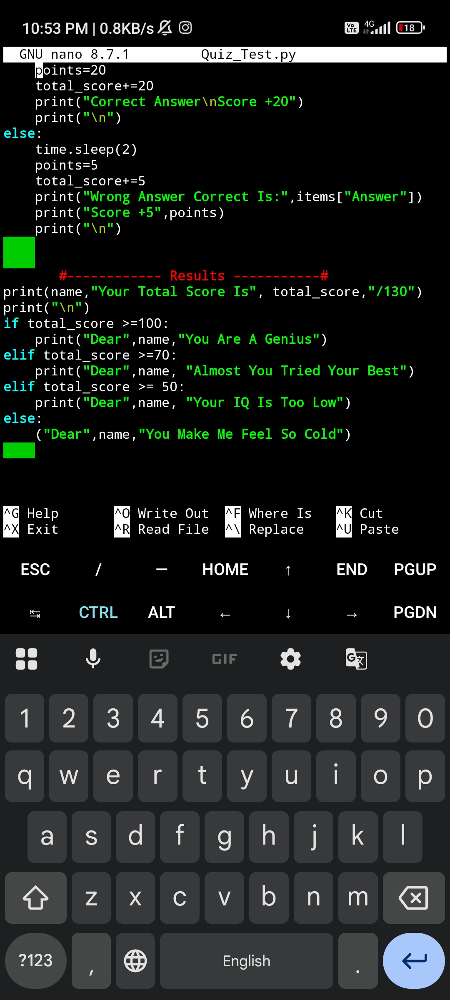

## 🔹 Kali Linux

```bash
sudo apt update && sudo apt upgrade
sudo apt install python3
sudo apt install git
```

Clone Repository:

```bash
git clone https://github.com/SahilAli9/python-iq-tester.git
```

Open Folder:

```bash
cd python-iq-tester
```

Run Project:

```bash
python3 quiz_project.py
```

---




# 🧠 Topics Used

- Variables
- Lists
- Dictionaries
- Loops
- Conditions
- User Input
- time.sleep()
- Score System

---

# 🔥 Future Updates

- Timer System
- Random Questions
- Difficulty Levels
- Save Results
- Leaderboard
- Better UI

---

# 📌 Note

This project was created while learning Python on mobile device using terminal based editors.

---

# ⭐ Support

If you like this project:
- Star the repository
- Fork it
- Improve it
- Share feedback

---

# 😈 THE_KIRA_X
Learning Python One Project At A Time.